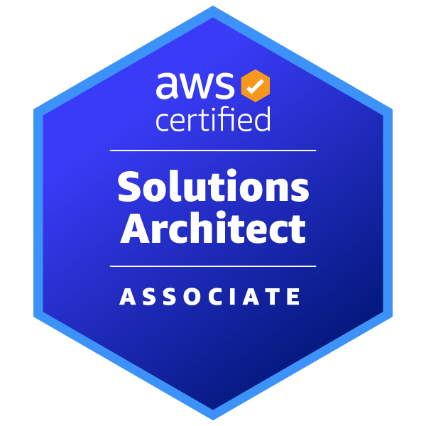
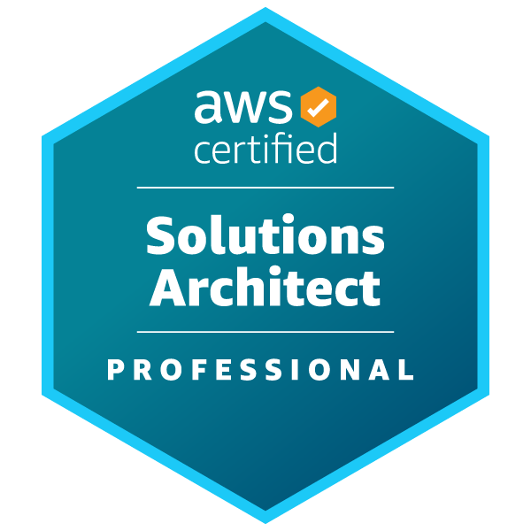

### Hi there 👋

My name is Hieu Nguyen, but people call me James too!

I'm a highly adaptable, comfortably multi-tasking person. Still on the path to learning more.

- 🔭 I’m currently working with Serverless, NodeJs, AWS
- 🌱 Currently learning Kubernetes, Golang
- 🙊 I speak Vietnamese, English, some Japanese
- ⚡ I like coffee ☕️ and cats 🐈

Reach me through my email under my avatar, or [Linkedin](https://www.linkedin.com/in/hieunguyen245/) !

